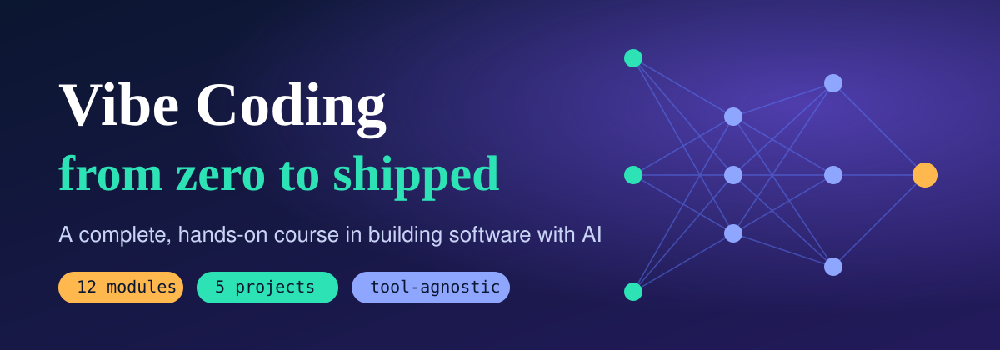
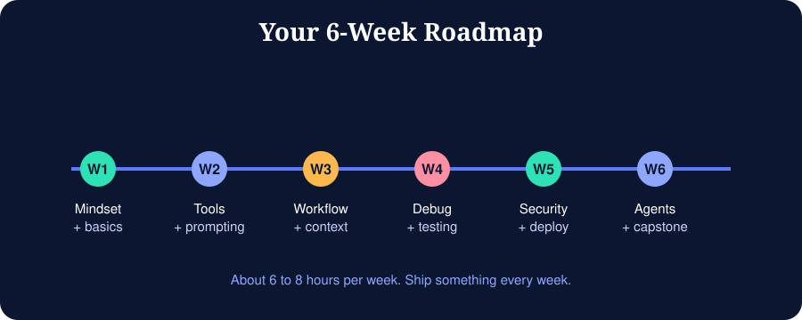

# Vibe Coding: The Complete Course

Learn to build real software by working with AI coding tools, without turning into someone who pastes code they do not understand.

**Vibe coding** means describing what you want in plain language and letting an AI write the code, while you steer, run, review and refine. The term was popularised by Andrej Karpathy in early 2025. This course keeps the speed of that idea and adds the engineering habits that make the result safe, maintainable and yours.

## Who this is for

- Students and beginners who want to ship projects fast
- Developers who want a structured workflow for AI-assisted coding
- Founders and makers who want prototypes without a full team

No prior experience is required. Module 02 covers the fundamentals you still need.

## How the course is organised

| # | Module | You will learn |
|---|--------|----------------|
| 00 | [Start here](modules/00-start-here.md) | How to use this course, setup checklist |
| 01 | [What is vibe coding](modules/01-what-is-vibe-coding.md) | History, mindset, when it works and when it fails |
| 02 | [Fundamentals you still need](modules/02-fundamentals.md) | Terminal, Git, HTTP, JSON, reading code |
| 03 | [The tool landscape](modules/03-tool-landscape.md) | App builders, AI editors, terminal agents |
| 04 | [Prompting for code](modules/04-prompting.md) | Prompt anatomy, patterns, anti-patterns |
| 05 | [The workflow](modules/05-workflow.md) | Spec, plan, generate, review, commit |
| 06 | [Context engineering](modules/06-context-engineering.md) | Rules files, memory, MCP, managing the context window |
| 07 | [Hands-on tool tutorials](modules/07-hands-on-tutorials.md) | Step-by-step in each tool category |
| 08 | [Debugging and testing](modules/08-debugging-testing.md) | Fix errors with AI, write tests, verify output |
| 09 | [Security and quality](modules/09-security-quality.md) | Secrets, injection, dependency risks, code review |
| 10 | [Deploying](modules/10-deploying.md) | GitHub, Vercel, Render, CI, environment variables |
| 11 | [Agents and advanced workflows](modules/11-agents-advanced.md) | Sub-agents, MCP servers, automation, parallel work |
| 12 | [Capstone and career](modules/12-capstone-career.md) | Final project, portfolio, next steps |

Supporting material:

- [`projects/`](projects/) five guided build projects from beginner to advanced
- [`exercises/`](exercises/) practice tasks and quizzes per module
- [`resources/`](resources/) glossary, cheat sheet, prompt library, tool comparison

## Suggested pace

Six weeks at 6 to 8 hours per week. Do one module and one exercise set per session, and ship one small thing every week.

## A note on tools

AI tools change quickly: names, pricing, limits and models shift every few months. This course teaches **transferable skills** and names tools as examples. Always check each tool's official documentation for current features and pricing before you commit.

## Contributing

Found a mistake or an outdated tool? Open an issue or pull request. See [CONTRIBUTING.md](CONTRIBUTING.md).

## License

Content is released under the MIT License. See [LICENSE](LICENSE).
