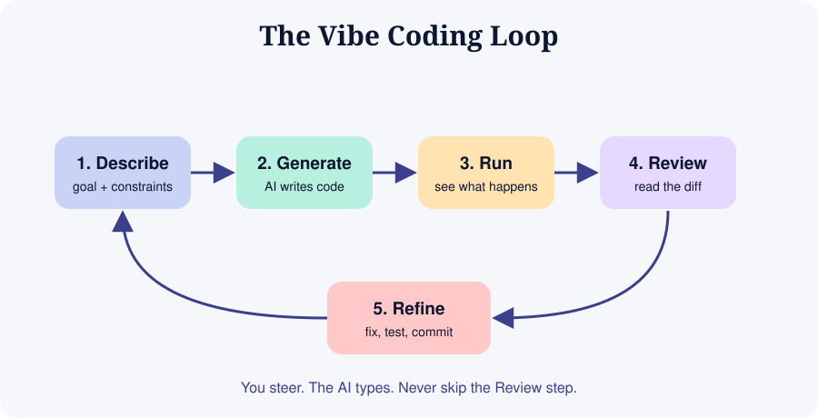

# Module 01: What Is Vibe Coding?

## 1.1 Definition

**Vibe coding** is a style of programming where you describe intent in natural language, an AI model generates code, and you iterate by running the result and giving feedback, often without reading every line at first.

The phrase was popularised by AI researcher Andrej Karpathy in early 2025 to describe "giving in to the vibes" and letting the model do the typing.

## 1.2 A spectrum, not a switch

| Style | Who reads the code? | Good for |
|-------|--------------------|----------|
| Pure vibe coding | Nobody, you judge by behaviour | Throwaway prototypes, demos, weekend toys |
| **Responsible vibe coding** | You review diffs and tests | Personal tools, MVPs, most learning projects |
| AI-assisted engineering | You design, AI drafts, you review every line | Production systems, teams |

This course teaches you to move along the spectrum on purpose, choosing the right level for the stakes.

## 1.3 Why it works

- Large language models have seen enormous amounts of code and documentation.
- Common problems (CRUD apps, forms, APIs, scripts) are well represented in that training.
- Feedback is instant: run it, see it, correct it.

## 1.4 Why it fails

| Failure | What happens | Defence |
|---------|--------------|---------|
| Hallucinated APIs | Code calls functions that do not exist | Run it, check official docs |
| Silent bugs | Works on the happy path, breaks on edge cases | Tests, manual edge-case checks |
| Security holes | Injection, exposed secrets, weak auth | Module 09 checklist |
| Spaghetti growth | Each fix adds mess until nobody understands it | Small commits, refactor prompts |
| Context drift | Model forgets earlier decisions in long chats | Rules files, fresh sessions (Module 06) |
| Skill atrophy | You stop learning | Ask "why", write some code yourself |

## 1.5 The three skills that matter most

1. **Specification**: saying precisely what you want
2. **Verification**: proving it works and is safe
3. **Orientation**: understanding enough of the codebase to steer

Typing speed is no longer the bottleneck. Clarity and judgment are.

## 1.6 When to vibe, when to slow down

**Vibe freely:** prototypes, UI experiments, scripts you run once, learning projects.

**Slow down:** payments, authentication, medical or legal data, anything with real users' personal data, anything that can delete data.

## Exercise
Write down three app ideas. For each, label the risk (low, medium, high) and pick your coding style from the spectrum above. Put it in your journal.

## Key takeaways
- Vibe coding is a loop: describe, generate, run, review, refine.
- Speed is real, and so are the risks.
- Your job shifts from typing to specifying and verifying.
