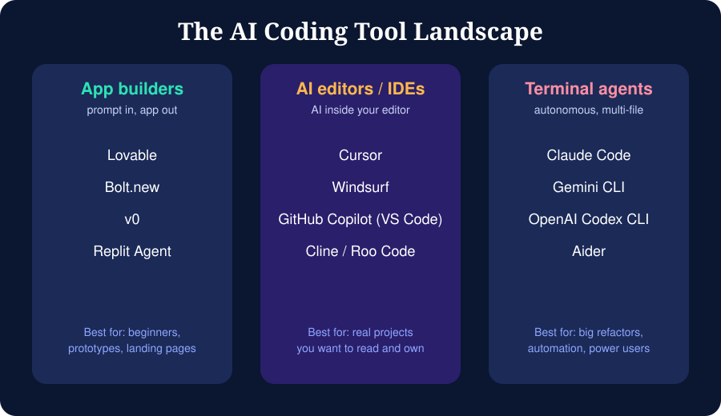

# Module 03: The AI Coding Tool Landscape

> Tool names, features, models and pricing change often. The categories below are stable; the examples are a snapshot. Check official sites before choosing.

## 3.1 Three categories

### A. App builders (prompt in, working app out)
Browser-based tools that generate, host and preview a full app from a chat.
- **Examples:** Lovable, Bolt.new, v0 (UI components), Replit Agent
- **Strengths:** zero setup, instant preview, one-click deploy, great for beginners and prototypes
- **Weaknesses:** less control, harder to customise deeply, can get expensive or stuck on complex logic
- **Use when:** you want a prototype in an hour, a landing page, or a demo for a stakeholder

### B. AI code editors and IDE assistants
An editor where AI is built in: inline completion, chat, and multi-file edits.
- **Examples:** Cursor, Windsurf, GitHub Copilot in VS Code, Cline / Roo Code (VS Code extensions)
- **Strengths:** you see and own the code, good diff review, works on existing projects
- **Weaknesses:** needs basic dev setup; you must manage context
- **Use when:** building real projects you will maintain

### C. Terminal and autonomous agents
Command-line agents that read your repo, edit files, run tests and commands.
- **Examples:** Claude Code, Gemini CLI, OpenAI Codex CLI, Aider
- **Strengths:** powerful for multi-file refactors, test-fix loops, automation and scripting
- **Weaknesses:** can run risky commands; needs Git discipline and permission awareness
- **Use when:** large tasks, migrations, CI automation, repetitive engineering chores

## 3.2 Choosing a tool

| Your situation | Start with |
|----------------|-----------|
| Never coded, want to see results today | App builder |
| Learning to code, want to understand output | AI editor |
| Comfortable with Git and terminal | Terminal agent + an editor |
| Building a UI from a screenshot or idea | v0 or an app builder, then export to an editor |
| Existing large codebase | AI editor or terminal agent with good context files |

**Practical advice:** learn one tool from each category at a basic level. The skills transfer, because every tool is a chat plus file access plus a model.

## 3.3 Features to compare

| Feature | Question to ask |
|---------|-----------------|
| Model choice | Can I switch models? Is there a cheaper fast model for small tasks? |
| Context | How many files can it see? Can I reference files with `@`? |
| Agent mode | Can it run commands and tests by itself? |
| Permissions | Does it ask before editing or running commands? |
| Rules/memory files | Does it read project instructions (e.g. `CLAUDE.md`, `AGENTS.md`, `.cursorrules`)? |
| MCP support | Can I connect external tools (databases, GitHub, docs)? |
| Privacy | Is my code used for training? Is there a privacy mode? |
| Cost model | Subscription, usage-based, or bring-your-own-key? |
| Export | Can I get my code out to GitHub easily? |

## 3.4 Model families
Most tools let you choose among models from providers such as Anthropic (Claude), OpenAI (GPT), Google (Gemini), plus open models (Llama, DeepSeek, Qwen, Mistral). Generally:
- **Larger, more capable models**: planning, architecture, hard bugs
- **Smaller, faster models**: boilerplate, renaming, small edits, quick questions

Use a strong model to plan and a fast model to execute when cost matters.

## 3.5 Free and low-cost ways to start
- Free tiers of app builders and editors (limits vary)
- Free API tiers from model providers (good for learning API apps)
- Local models via tools such as Ollama (runs on your machine, no per-token cost, needs a decent computer)
- Student programs: many vendors offer discounts, so check GitHub Student Developer Pack and vendor pages

## Exercise
Fill in `resources/tool-comparison.md` for two tools you try. Build the same tiny app (a to-do list) in both and compare the results.
