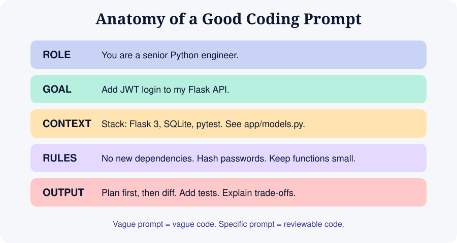

# Module 04: Prompting for Code



## 4.1 The core idea
The model predicts useful code from the text you give it. **Specific input produces reviewable output.**

## 4.2 The ROGCO frame
- **R**ole: who the AI should act as
- **O**utput: format you want (plan, diff, file, explanation)
- **G**oal: the single outcome
- **C**ontext: stack, files, existing conventions
- **O**ther rules: constraints, what not to do

### Weak vs strong

| Weak | Strong |
|------|--------|
| "Make a login page" | "Add an email+password login page to my Next.js 14 app (App Router, Tailwind). Validate input client-side, show inline errors, call `POST /api/login`. Match the style of `components/Button.tsx`. Do not add new libraries." |
| "It doesn't work" | "Clicking Save throws `TypeError: cannot read properties of undefined (reading 'id')` at `save.js:42`. Here is the function and the console output. Explain the cause first, then propose the smallest fix." |
| "Make it better" | "Refactor `utils.py` to remove duplication. Keep behaviour identical. Show the diff and list anything risky." |

## 4.3 Ten reliable patterns

1. **Plan first**: "Do not write code yet. Propose a plan in numbered steps and list assumptions."
2. **Small steps**: one feature per prompt, then test.
3. **Show, don't tell**: paste an example input and the expected output.
4. **Constrain scope**: "Only modify `auth.py`. Do not touch other files."
5. **Ask for options**: "Give me two approaches with trade-offs, then recommend one."
6. **Explain before edit**: "Explain what the current code does, then suggest changes."
7. **Tests first**: "Write failing tests for this behaviour, then implement it."
8. **Self-review**: "Review your own change for bugs, security issues and edge cases."
9. **Rubber duck**: "Ask me clarifying questions before you begin."
10. **Reference existing style**: "Follow the patterns in `@routes/users.py`."

## 4.4 Anti-patterns

| Anti-pattern | Why it hurts | Fix |
|--------------|-------------|-----|
| Mega-prompt with ten features | Model drifts, bugs hide | One feature at a time |
| Endless chat in one session | Context gets noisy and contradictory | New session + summary file |
| Accepting all changes blindly | Bugs compound | Review every diff |
| Hiding errors | Model guesses | Paste the exact error and logs |
| Vague adjectives ("clean", "modern") | Different meaning to everyone | Give examples, references, constraints |
| Arguing with the model | Wastes context | Revert, rewrite the prompt |

## 4.5 Debugging prompts
Include: **expected vs actual**, **exact error text**, **relevant code**, **what you already tried**, **environment** (OS, versions).

```
Expected: clicking "Add" appends an item to the list.
Actual: page reloads and list is empty.
Code: [paste component]
Console: [paste output]
Tried: removing preventDefault, no change.
Env: React 18, Vite, Chrome.
Question: what is the likely cause? Give 3 hypotheses ranked, then test the top one.
```

## 4.6 Prompting UI work
- Describe layout in words: "two-column, sidebar 280px, sticky header"
- Name the design system: "Tailwind, shadcn/ui"
- Give references: screenshots or links (many tools accept images)
- Specify states: empty, loading, error, success
- Specify responsiveness and accessibility: "mobile-first, keyboard accessible, WCAG AA contrast"

## 4.7 Iteration etiquette
1. Run the code after each step.
2. If broken, paste the error back.
3. If after two attempts it is still wrong, **revert** and rewrite the prompt with what you learned.

## Exercises
See `exercises/module-04.md`. Also browse `resources/prompt-library.md`.
