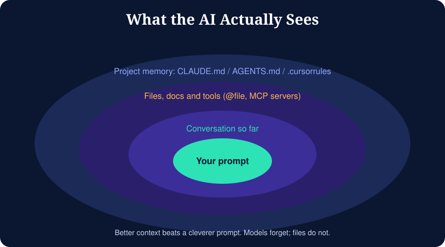

# Module 06: Context Engineering



## 6.1 Why context matters
A model has no memory of your project except what is in its **context window**: the text it can see right now. Good results come from putting the right information there and keeping noise out.

## 6.2 What goes into context
1. Your current prompt
2. The conversation so far
3. Files you attach or reference
4. Tool results (command output, search results)
5. Persistent project instructions (rules files)

Context windows are large but not infinite, and quality can drop when they fill with irrelevant or contradictory text.

## 6.3 Rules files (project memory)
Most tools read a markdown file at the start of every session. Names differ by tool (for example `CLAUDE.md`, `AGENTS.md`, `.cursorrules` or `.cursor/rules`, Copilot instructions files). Check your tool's docs for the exact name and location.

### Template
```markdown
# Project: Expense Tracker

## Stack
Python 3.12, FastAPI, SQLite, pytest. Frontend: plain HTML + vanilla JS.

## Commands
- Run: `uvicorn app.main:app --reload`
- Test: `pytest -q`
- Lint: `ruff check .`

## Conventions
- Type hints on all functions
- One router per resource in `app/routers/`
- Never commit `.env`; use `.env.example`
- Small functions, docstrings for public ones

## Rules
- Ask before adding dependencies
- Write or update tests for every behaviour change
- Do not modify files in `migrations/` by hand

## Architecture notes
Routers call services; services call repositories; only repositories touch SQL.
```
Keep it **short and specific**. Update it when the AI repeats a mistake: that is a missing rule.

## 6.4 Managing long sessions
| Symptom | Action |
|---------|--------|
| AI forgets earlier decisions | Put decisions in `SPEC.md` or the rules file |
| AI repeats failed fixes | Start a fresh session with a short summary |
| Responses get slower or sloppier | Clear or compact the conversation |
| Wrong files edited | Reference exact files with `@path` |

**Handoff summary prompt:**
> "Summarise our progress for a fresh session: goal, decisions made, files changed, what works, what is broken, next step. Keep it under 200 words."

## 6.5 Giving the AI the right files
- Reference only relevant files
- For large repos, point at entry points and the files you expect to change
- Paste error output rather than describing it
- Provide docs: paste the relevant section, or use a docs-fetching tool or MCP server

## 6.6 MCP (Model Context Protocol)
MCP is an open standard that lets AI tools connect to external systems through small servers: file systems, GitHub, databases, browsers, documentation, design tools, and more.

```
AI tool  <--MCP-->  GitHub server    (issues, PRs)
         <--MCP-->  Database server  (read-only queries)
         <--MCP-->  Docs server      (up-to-date library docs)
```

**Safety:** only install MCP servers you trust, grant read-only access where possible, and never give production credentials to an experimental server.

## 6.7 Keeping the model honest with docs
Models can be out of date on fast-moving libraries. When using a recent framework version, paste the official docs snippet or point the tool to it, and state the exact version in your prompt.

## Exercise
Write a rules file for one of your projects. Start a new session and check the AI follows it. Improve it after the first mistake.
