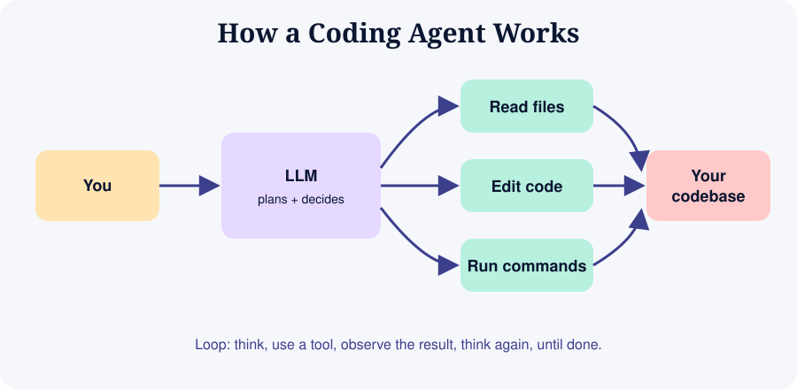

# Module 11: Agents and Advanced Workflows



## 11.1 What is an agent?
An **agent** is an LLM in a loop with tools. It reads your request, decides an action (read a file, edit, run a command, search), observes the result, and repeats until done or stuck.

## 11.2 Why agents help and hurt
| Helps | Hurts |
|-------|-------|
| Multi-file changes without copy-paste | Can wander beyond scope |
| Runs tests and fixes failures in a loop | Can burn time and tokens looping |
| Automates repetitive chores | May take risky actions if permissions are loose |

## 11.3 Giving agents good tasks
**Good:** "Add pagination to `/notes` (limit/offset), update tests, update README. Run the test suite and stop when green. Do not touch unrelated files."

**Bad:** "Improve my app."

Include: objective, boundaries, success criteria, how to verify, when to stop and ask.

## 11.4 Useful advanced techniques
1. **Plan then execute**: separate planning (strong model) from execution (fast model).
2. **Sub-agents / parallel sessions**: one session on backend, another on docs, each on its own branch or Git worktree.
3. **Git worktrees**: `git worktree add ../app-feature-x feature-x` to run parallel experiments safely.
4. **Custom commands / prompts**: save repeated prompts (review, test, release notes) as reusable commands where your tool supports it.
5. **Hooks and automation**: run formatters, linters or tests automatically after edits where supported.
6. **Headless mode**: run an agent from scripts or CI for chores like dependency updates or PR summaries.
7. **Code review agents**: ask a second model to review the first model's diff.

## 11.5 Building your own AI features
Vibe coding helps you build apps that *use* AI too.

```python
# Minimal pattern: call an LLM API from a backend (pseudo-structure)
def summarise(text: str) -> str:
    prompt = f"Summarise in 3 bullet points:\n\n{text}"
    response = llm_client.generate(prompt)   # use your provider's SDK
    return response.text
```
Important design points:
- Keep API keys on the **server** only
- Validate and limit input size
- Handle timeouts, rate limits, and failures
- Log cost and latency
- Treat model output as untrusted text (never execute it blindly)
- Consider prompt injection if the input includes external content

### Common AI app patterns
| Pattern | Description |
|---------|-------------|
| Chat assistant | System prompt + conversation history |
| RAG (retrieval-augmented generation) | Search your documents, feed relevant chunks to the model |
| Structured extraction | Ask for JSON matching a schema, validate it |
| Tool-using agent | Model calls functions you define (search, database, email) |
| Multi-agent workflow | Several specialised prompts/agents pass work along (e.g. researcher, writer, reviewer) |

## 11.6 Evaluating quality
- Keep a small set of example inputs and expected outputs
- Re-run them after each prompt or model change
- Track failures, not just successes

## 11.7 Responsible use
- Be transparent when AI features are used
- Give users a way to report wrong outputs
- Do not use AI output for high-stakes decisions without human review

## Exercise
Run two parallel agent sessions on separate branches (for example feature code and documentation), merge both, and record what went well or badly.
